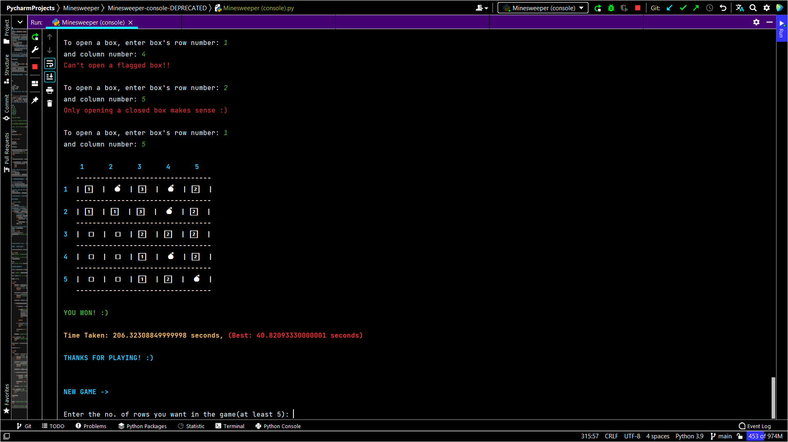

# Minesweeper-console-DEPRECATED

Code of the console version of Minesweeper, predecessor of [Minesweeper-for-PC](https://github.com/samyak1409/Minesweeper-for-PC) 
and very inefficient one because I implemented it in Aug-2020 when I was learning Python + little did I know that 
how important computational complexities are, and we have to focus on making logics as efficient as possible at that 
time :)

DEPRECATED because who will play a grid game on console by giving row and column number inputs 😬😂

You may ask "then why are you uploading this now", I am because 

## Jokes Aside

You can give it a try it's not that bad! Here are some screenshots:

## Ciao
